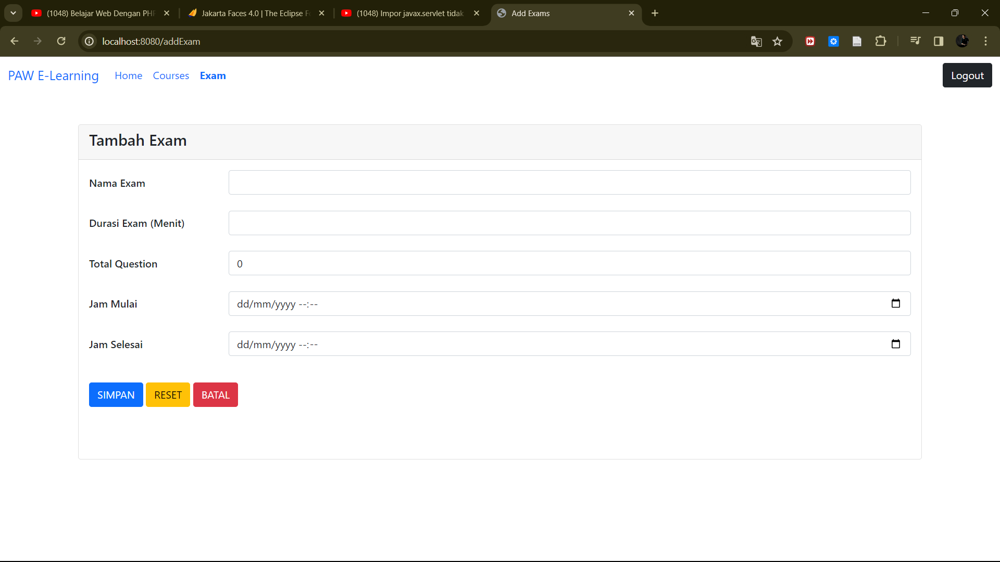
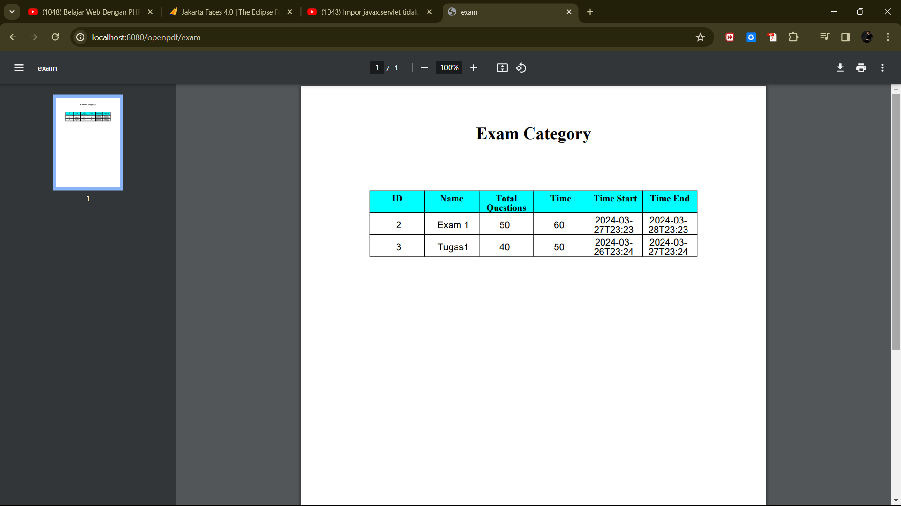
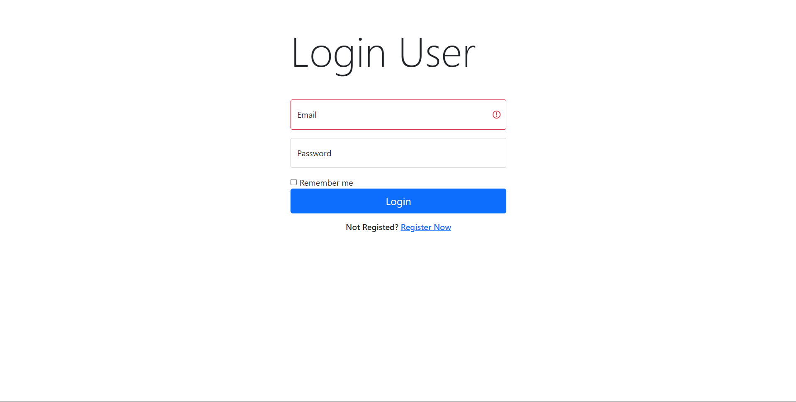
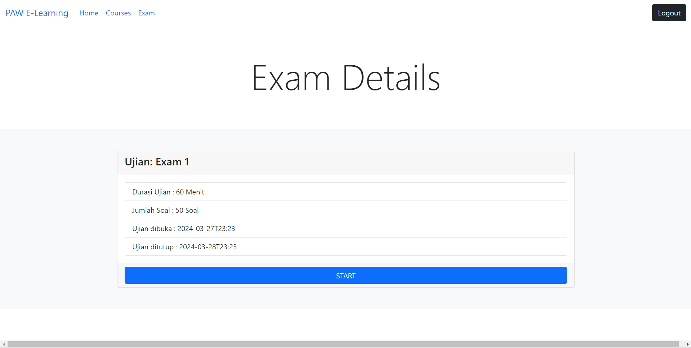

# RENTAL APP

This application is an application that I made based on the problems that exist around, Motorcycle rental is a problem experienced by local and international tourists, many tourists are looking for a place to rent a motorbike, but they themselves do not know where to look for it, so this application was made to support the needs of tourists easily. With this application, tourists will not be confused to find a motorbike rental place, because with this application, tourists can order a motorbike rental from their own place and the motorbike will be delivered to their destination.

Rental Motor is an application that I created with one of my friends as a final project from a database-based application development course, which includes several operations such as create, read, update, delete and the database used is mysql. I was responsible for implementing the create read update delete functionality and creating the database. After that I developed it myself when I took the entrance test to become a teaching assistant, I added search and filter/category features. 

Repository Link: https://github.com/HamamPriyatmoko/TesAsdos.git  

&nbsp;&nbsp;&nbsp;&nbsp;&nbsp;&nbsp;&nbsp;&nbsp;&nbsp;&nbsp;

# App Restaurant
I made this Restaurant application for the final project of semester 5, and this project is required to use firebase for the database. this is one of my best apps because here I first created a login feature using firebase authentication, and the data storage uses a faribase database.

When making this app there are mandatory features that must be made, namely CRUD, and there are a minimum of entities in the database, I made this app with 3 entities, namely for the login feature and 2 more entities, namely the Order and Food Menu. The creation of this app was inspired by one of the e-commerce apps, so I thought of making the restaurant app itself to make it easier to order, just look at the menu and you can choose it directly from the app. The creation of the UI itself using figma and made quite intuitive, made simple so that users are easy to understand in its use.

Repository Link: https://github.com/HamamPriyatmoko/RestaurantApp.git 

&nbsp;&nbsp;&nbsp;&nbsp;&nbsp;&nbsp;&nbsp;&nbsp;&nbsp;&nbsp;&nbsp;&nbsp;&nbsp;&nbsp;&nbsp;

# Web E-Learning
This web was created during exercise assignments and this web was created to facilitate learning for lecturers / teachers in giving an assignment,
some of the features provided are CRUD, Search engine, export to pdf, and Login. The first time using the spring boot framework to create a website, 
and the database used is php myadmin. for the display in html I use bootstrapp to make it look more intuitive and pleasing to the eye.

Repository Link: https://github.com/HamamPriyatmoko/E-Learning.git 

&nbsp;&nbsp;&nbsp;&nbsp;&nbsp;&nbsp;&nbsp;&nbsp;&nbsp;&nbsp;&nbsp;&nbsp;&nbsp;&nbsp;&nbsp;&nbsp;&nbsp;&nbsp;&nbsp;&nbsp;

